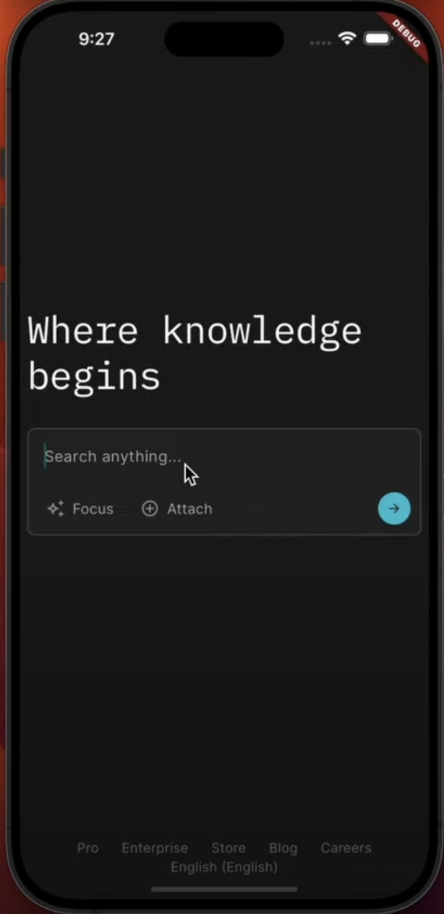
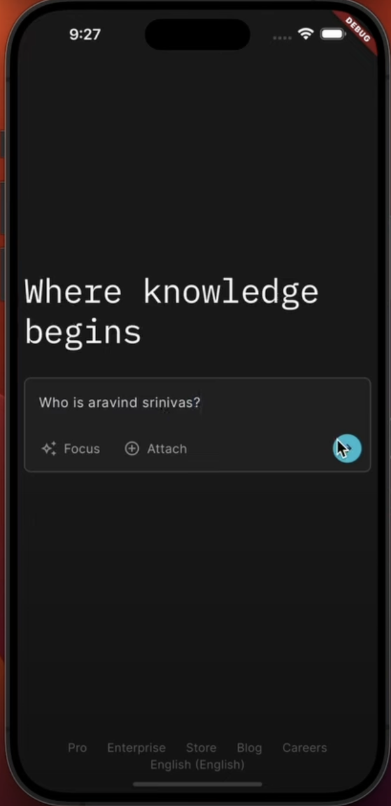
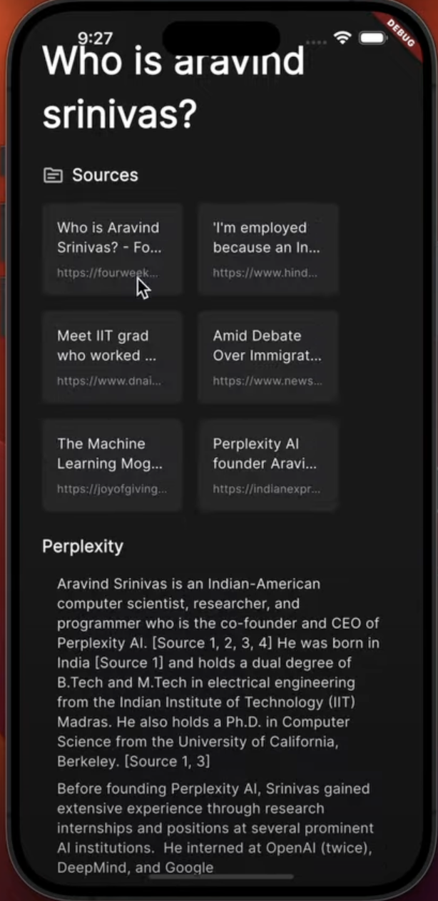

# Perplexity-v

## Features

- Real-time chat using **WebSocket**
- Cosine similarity search for relevant sources
- LLM-powered intelligent responses
- Mobile-friendly interface by **Markdown rendering**.

---

## How It Works

- **Frontend**: Flutter provides the mobile UI and communicates with FastAPI via WebSocket.
- **Backend**: FastAPI handles user input, searches online sources, and uses LLMs to generate responses.

---

## Running the App

### FastAPI Setup
doc - todo :(
```bash
cd server
python -m venv venv
source ./venv/bin/activate
pip install fastapi
```

### Flutter Setup
```bash
git clone https://github.com/vats004/perplexity-v.git
cd perplexity-v
flutter pub get
flutter run
```

<p align="left">
  
  
  
</p>
